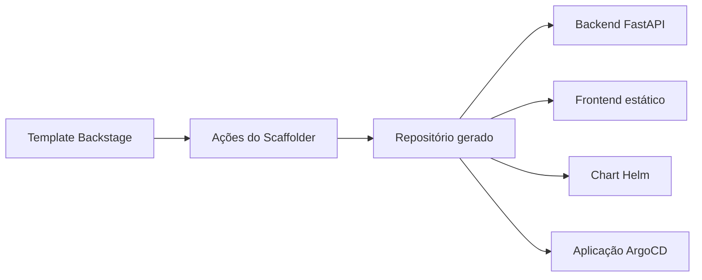
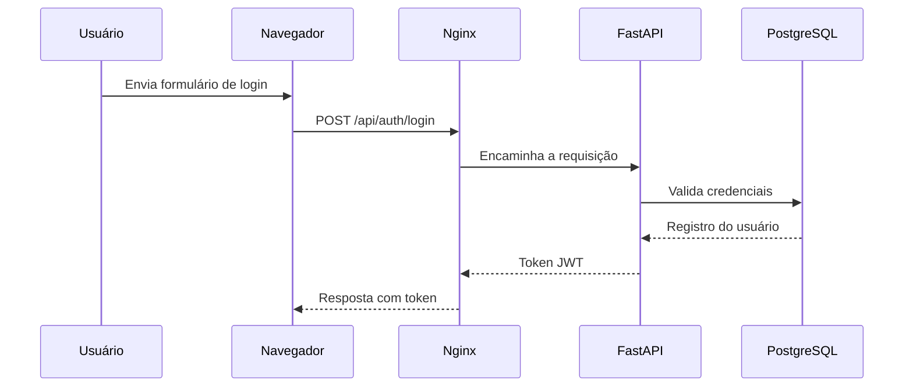
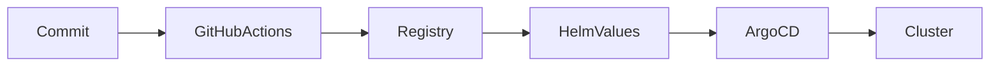

# Diagramas

## Fluxo do template até a aplicação

```mermaid
flowchart LR
  Backstage[Template Backstage] --> Scaffolder[Ações do Scaffolder]
  Scaffolder --> Repo[Repositório gerado]
  Repo --> Backend[Backend FastAPI]
  Repo --> Frontend[Frontend estático]
  Repo --> Helm[Chart Helm]
  Repo --> Argo[Aplicação ArgoCD]
```

## Fluxo de requisição

```mermaid
sequenceDiagram
  participant User as Usuário
  participant Browser as Navegador
  participant Nginx
  participant API as FastAPI
  participant DB as PostgreSQL

  User->>Browser: Envia formulário de login
  Browser->>Nginx: POST /api/auth/login
  Nginx->>API: Encaminha a requisição
  API->>DB: Valida credenciais
  DB-->>API: Registro do usuário
  API-->>Nginx: Token JWT
  Nginx-->>Browser: Resposta com token
```

## Fluxo de deploy

```mermaid
flowchart LR
  Commit --> GitHubActions --> Registry --> HelmValues --> ArgoCD --> Cluster
```
