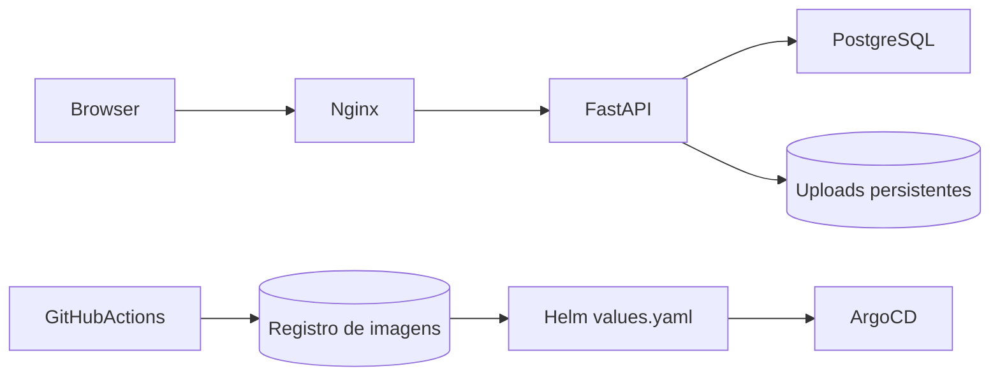

# Visão Geral do Sistema

## Arquitetura de alto nível

A aplicação gerada é um sistema web em duas camadas com banco de apoio e uma cadeia de entrega.

- O frontend é um site estático servido por Nginx.
- O frontend encaminha requisições sob `/api/` para o backend.
- O backend é um serviço FastAPI com autenticação JWT.
- O PostgreSQL armazena usuários e empresas.
- O Alembic gerencia a evolução do schema.

## Fluxo em tempo de execução

## Relação entre Backstage e a aplicação gerada

- `Template` descreve como o projeto é gerado.
- `Component` descreve o serviço gerado.
- `System` agrupa componentes relacionados sob um domínio de negócio ou plataforma.

## Comportamento em runtime

O backend aguarda o PostgreSQL antes de iniciar, aplica as migrações do banco e só então sobe o Uvicorn. O container do frontend injeta o host do backend na configuração do Nginx antes de servir o site.
